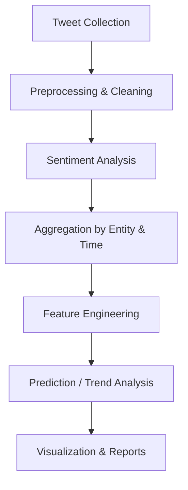
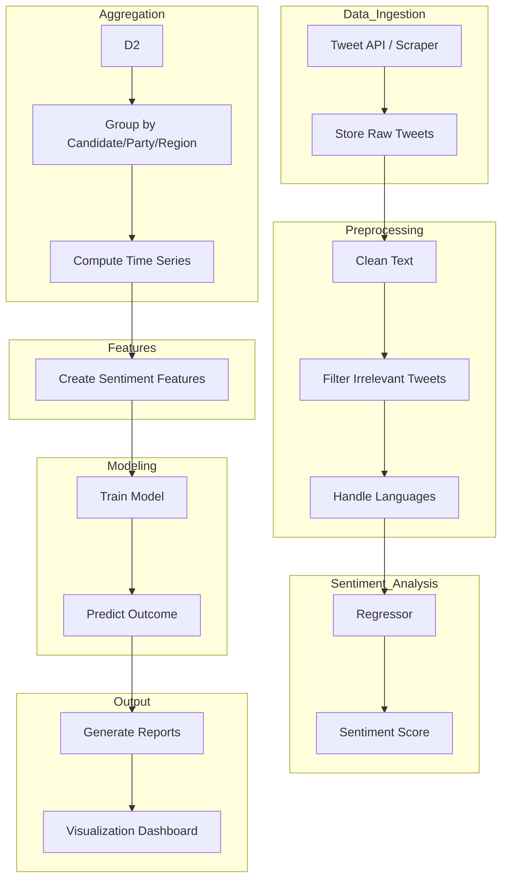

# 🗳️ Election Prediction Using Sentiment Analysis
### Predicting Electoral Trends Using Twitter Data featuring ReactJS, Machine Learning & Statistical Analysis
## 🚀 Overview

This project predicts election outcomes or political trends by analyzing public sentiment expressed on Twitter. By collecting tweets, processing them, running sentiment analysis, and aggregating the sentiment over time for political entities (parties/candidates), the system estimates public mood and attempts to forecast results.

## 📌 Key Objectives

- Collect election-related tweets using keywords, hashtags, party names, and candidate names.

- Clean and preprocess the raw tweet text.

- Classify sentiment (Positive, Negative, Neutral).

- Aggregate sentiment to form trend signals.

- Generate prediction metrics or directly forecast outcomes.

- Visualize sentiment comparisons and trends.


## 🔧 Features
### ✔️ 1. Twitter Data Collection

Collects tweets using keywords, hashtags, handles.

Supports election-specific filters.

Can use API v2 or scraping (depending on implementation).

Logic:
Identify relevant political entities → fetch real-time or historical tweets tied to those entities.

### ✔️ 2. Preprocessing & Cleaning

Removes URLs, mentions, RTs, emojis, special characters.

Handles multilingual text (Bengali, Hindi, English).

Removes stopwords & normalizes text.

Logic:
Ensures sentiment model receives clean, noise-free, uniform input.

### ✔️ 3. Sentiment Analysis

Classifies tweets into Positive / Negative / Neutral based on Lexicon approach

Logic:
Each tweet becomes a sentiment datapoint that reflects public opinion toward an entity.

### ✔️ 4. Feature Engineering

Extracted features:

Sentiment Score

Sentiment Ratio (Positive:Negative)

Sentiment Volatility

Trend slope

Engagement Score

Logic:
Features become input for predictive models.

### ✔️ 5. Prediction Module

Uses ML/Statistical models

Outputs:

Win probability

Sentiment-based ranking

Constituency-wise comparison

Logic:
Sentiment features → ML model → Forecast.

### 6. Visualization Dashboard

Sentiment over time

Party vs party volume and sentiment comparison

Logic:
Makes insights understandable and presentation-ready.

## 🧠 System Architecture


## 🔄 Detailed Workflow (Modular Pipeline)


## 📊 Example Use Case: West Bengal Elections

Keywords: “TMC”, “BJP”, “INC”, “CPIM”, candidate names, Bengali-specific hashtags.

Collect tweets for 3–6 months.

Clean and preprocess multilingual text (English/Bengali).

Classify sentiment for each tweet.

Aggregate per party weekly.

Create time-series features.

Predict seat-wise or overall trend.

## 🛠️ Installation & Usage
### 1. Clone the repository
```git clone https://github.com/shrestha3103/election-prediction-using-sentiment-analysis
cd election-prediction-using-sentiment-analysis
```

### 2. Install dependencies
```npm install```

### 3. Setup environment variables

Create .env:

```TWITTER_API_KEY=xxxx
TWITTER_API_SECRET=xxxx
ACCESS_TOKEN=xxxx
ACCESS_SECRET=xxxx
```

### 4. Run modules

```npm run collect       # Fetch tweets  
npm run preprocess    # Clean data  
npm run sentiment     # Run sentiment analysis  
npm run aggregate     # Group and score data  
npm run predict       # Run prediction  
npm run visualize     # Generate charts
```

## 📈 Outputs & Insights

You will get:

Sentiment trends for each party/candidate

Comparative sentiment graphs

Election prediction / probability estimate

Analytical report & plots

## 🔮 Future Enhancements

Add Bengali/Hindi sentiment model for better accuracy in West Bengal.

Build a React dashboard to visualize trends.

Include bot detection to reduce noise.

Integrate historical election data for stronger modeling performance.

Add geolocation inference for constituency-level predictions.

## 📚 References

Twitter API documentation

Research papers on election prediction using sentiment analysis

### 🙋‍♀️ Author

Shrestha Kundu
