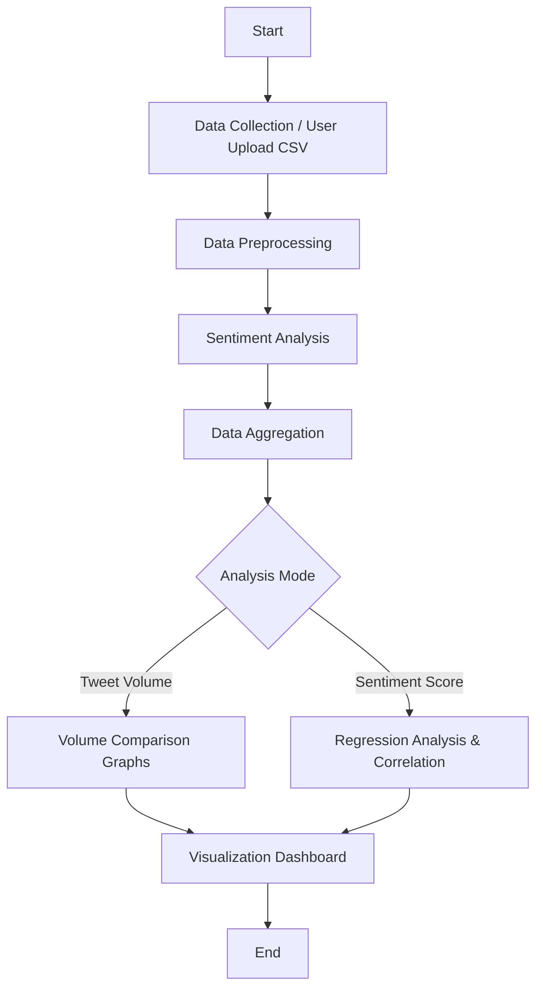

# 🗳️ Electoral Result Prediction System
### Predicting Electoral Trends Using Twitter Data featuring ReactJS, Machine Learning & Statistical Analysis
This project is a computational intelligence tool designed to predict electoral results by **analyzing tweet volume** and **performing sentiment analysis** on political discourse.<br>
It allows users to upload their own datasets (CSV) to generate real-time insights, regression models, and visualizations.

## 📖 About the Project
Traditional exit polls rely on sample surveys, which can be expensive and time-consuming. This project proposes a Big Data approach to psephology (the study of elections). By leveraging Twitter data, we analyze the sentiment polarity (positive vs. negative) and the sheer volume of discussions regarding political parties to forecast election results.<br>
**The system tests the hypothesis that higher sentiment scores and tweet volumes correlate positively with vote share and seat share.**

## 🚀 Live Demo
Check out the live application:  [Electoral Result Prediction Using Social Media Analysis](https://electoral-result-prediction.netlify.app/)

## 👉 🏗 System Architecture
The application follows a streamlined data processing pipeline, moving from raw data ingestion to visual analytics.


## 🧠 Methodology & Logic
### The Algorithm -
- **Data Collection:** The system accepts a CSV file containing political tweets. (Example datasets are provided in the data/ folder).
Preprocessing:
- **Stop Word Removal:** Filtering out common words (is, the, are) that carry no sentiment weight.
Tokenization: Breaking tweets into individual words.
- **Normalization:** Converting text to lowercase and removing special characters.
- **Sentiment Analysis:**
Uses Lexicon-based scoring (referencing Hu and Liu’s sentiment dictionary and AFINN-111).
Tweets are classified as Positive, Negative, or Neutral.
- **Regression Analysis:**
Applies Linear or Polynomial Regression to model the relationship between the calculated Sentiment Score (X) and Vote Share (Y).
Calculates the R-squared value to validate the strength of the correlation.
### Mathematical Model -
To quantify the overall sentiment for a political party, we use a specific weighted scoring formula. This formula emphasizes positive engagement while accounting for volume and negative feedback.

$$P = (0.6 \times n_1) + (0.1 \times n) + (0.3 \times n_2)$$

Where,
$P$ = Overall Sentiment Score
$n_1$ = Number of Positive tweets
$n$ = Total number of tweets analyzed
$n_2$ = Number of Negative tweets (calculated as $n - n_1$)

Note: The weights (0.6, 0.1, 0.3) prioritize positive sentiment (60%) but acknowledge that even negative publicity ($n_2$) and total noise ($n$) contribute to a party's visibility.

## ✨ Features
- **📂 CSV Data Upload:** Users can upload their own Twitter datasets for custom analysis.
- **📊 Dual Analysis Modes:**
  - **Party Tweet Volume Analysis:** Visualizes the raw count of tweets over time for different parties (e.g., TMC, BJP, INC, CPIM).
  - **Sentiment Analysis:** Generates sentiment scores and correlates them with actual vote shares.
- **📈 Interactive Visualizations:**
  - Line graphs for temporal volume trends.
  - Scatter plots for regression analysis.
- **🧮 Statistical Metrics:** Automatically calculates Regression Equations (Slope) and P-values.
- **📱 Responsive Design:** Built with React.js for a seamless experience on mobile and desktop.

## 🛠 Tech Stack
**Frontend:** React.js, Tailwind CSS, Recharts for visualization.
**Backend:** Python
**Data Processing:** Pandas, NumPy, Scikit-learn.

## ⚡ Getting Started
To run this project locally, follow these steps:

### 1️⃣ Clone the repo
```
git clone [https://github.com/shrestha3103/electoral-result-prediction.git](https://github.com/shrestha3103/electoral-result-prediction.git)
cd electoral-result-prediction
```

### 2️⃣ Install Dependencies
```npm install```

### 3️⃣ Start Development Server
```npm run start```


## 🖥 Usage Guide
1. **Open the App:** Navigate to the live link or your local host.
2. **Select Mode:** Choose between ***Party Tweet Volume*** or ***Sentiment Analysis*** via the radio buttons.
3. **Upload Data:**
   - Click the upload button and select your .csv file containing tweet data.
   - Tip: Use the csv files provided in this repo to test.
4. **View Results:**
   - **Volume Graphs:** See how much people are talking about each party.
   - **Correlation Curve:** Observe the prediction line $y = mx + c$ and see how well sentiment predicts votes.

## 📉 Results & Analysis
Our experimental results using historical data demonstrated a **strong positive correlation between social media sentiment and electoral performance.**

Regression Equation: $y = 4189.0295x + 180736.3719$

R-Squared Value: 73.94% (Indicating a strong relationship)

## 🔮 Future Enhancements
- **Real-time Twitter API Integration:** Fetch live tweets instead of relying on CSV uploads. (paid)
- **Multilingual Support:** Analyze tweets in regional languages (Hindi, Bengali, etc.).
- **Deep Learning Models:** Implement LSTM or BERT for more nuanced sentiment detection (sarcasm detection).
- **Geospatial Mapping:** Visualize sentiment hotspots on a map.

## 📝 License
Distributed under the MIT License. See LICENSE for more information.
<p align="center">
Made with ❤️ by Shrestha Kundu
</p>
